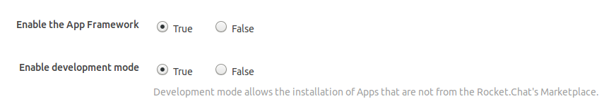
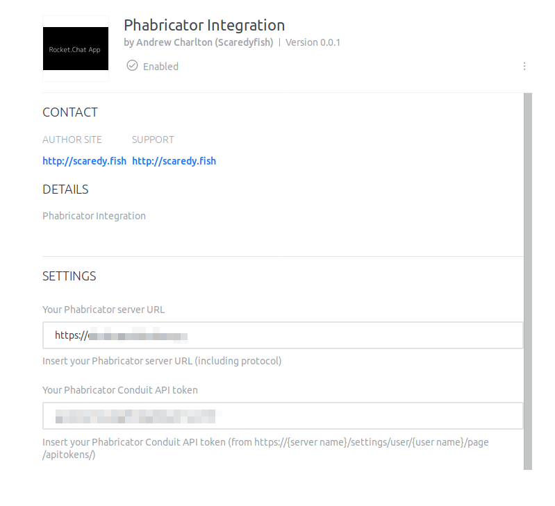

# Phabricator Integration for Rocket.Chat 

Features:
* **Auto expand Maniphest task IDs**


# Installation

In Rocket.Chat settings under **General->Apps** enable the App Framework and development mode.



Install the rc-apps command line tool as described at https://rocket.chat/docs/developer-guides/developing-apps/getting-started/


To install the app for the first time:

```rc-apps deploy --url http://your.server --username admin_name --password admin_password```

To update to a newer version:

```rc-apps deploy --url http://your.server --username admin_name --password admin_password --update```

In Rocket.Chat settings, under Apps, select Phabricator Integration and fill in your Phabricator server URL and a Phabricator Conduit API token from https://{server name}/settings/user/{user name}/page/apitokens/ 


